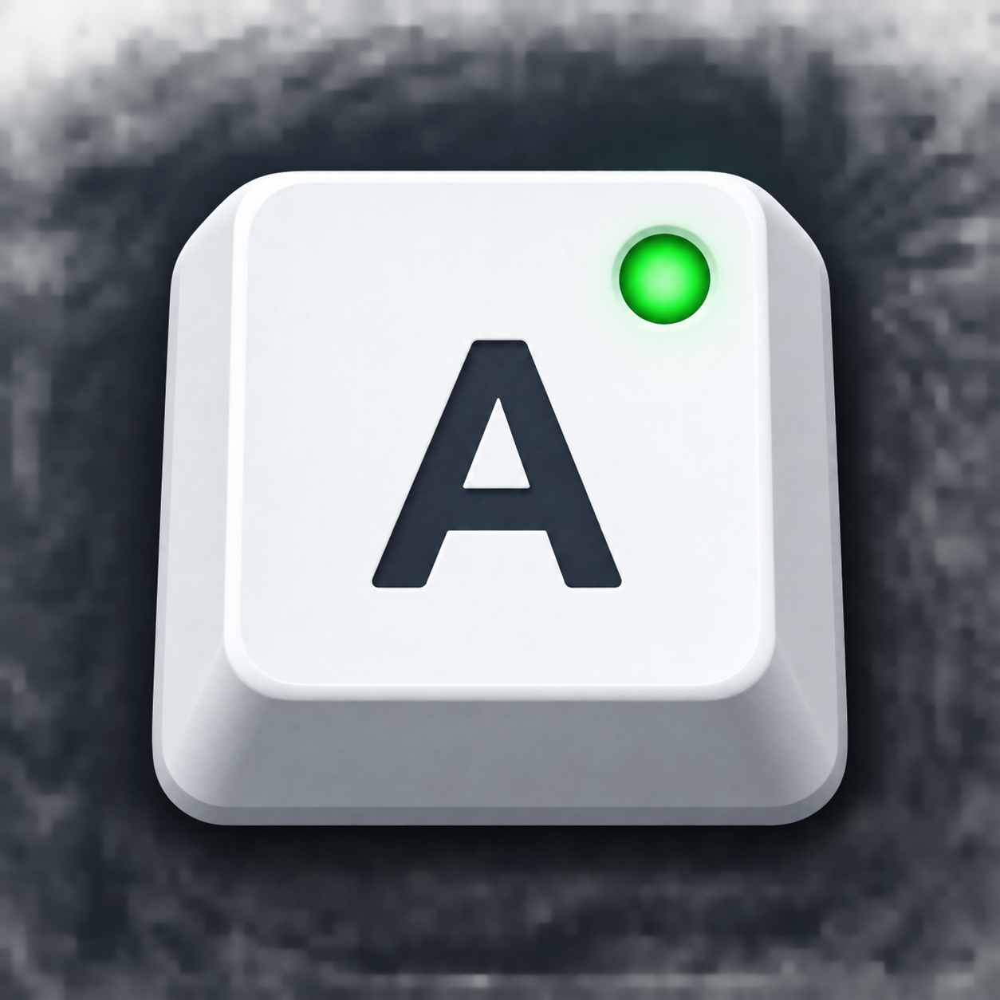

# Caps Lock 右下角指示器

  

免安裝的 Windows 小工具，在通知區與螢幕上顯示目前的 Caps Lock 狀態。

  <a href="https://raw.githubusercontent.com/Bserz1331/caps-lock-indicator/main/CapsLockIndicator.exe">下載目前版本 v1.3.0</a> ·
  <a href="README.md">English</a> ·
  <a href="src/CapsLockIndicator.cs">查看原始碼</a>

Caps Lock 右下角指示器會在 Windows 通知區顯示 `A` 或 `a`，當 Caps Lock 狀態改變時，也會在目前使用中的螢幕中央顯示短暫提示。

它只讀取 Windows 回報的 Caps Lock 狀態，不會重新對應按鍵、不會修改鍵盤輸入，也不會執行背景服務。

## 下載與開始使用

1. 從本 repository 下載目前的 [`CapsLockIndicator.exe`](https://raw.githubusercontent.com/Bserz1331/caps-lock-indicator/main/CapsLockIndicator.exe)。
2. 將檔案保存到不會任意移動的資料夾，不需要安裝程式。
3. 雙擊 `CapsLockIndicator.exe` 啟動。
4. 如果希望使用容易辨識的啟動檔，可雙擊 `啟動 Caps Lock 指示器.bat`；英文啟動檔也一併提供。
5. 到 Windows 工作列右下角的通知區查看圖示。若看不到，請先點選隱藏圖示區的 `^`。

目前公開版本為 v1.3.0。此 repository 目前是直接在 main 分支提供 EXE，尚未透過 GitHub Release 發布。

EXE 目前沒有數位簽章，Windows 可能顯示 SmartScreen 來源警告。執行前請確認檔案來自本 repository；若出現警告，確認來源後再選擇 **More info**，接著選擇 **Run anyway**。

## 畫面怎麼看

| 顯示內容 | 意義 |
| --- | --- |
| 綠色按鍵與 `A` | Caps Lock 已開啟。 |
| 灰色按鍵與 `a` | Caps Lock 已關閉。 |
| 螢幕中央提示 | 狀態改變時出現，會保持在其他視窗上方，之後自動消失。 |
| 通知區提示文字 | 顯示 `Caps Lock：開啟` 或 `Caps Lock：關閉`。 |
| 右鍵選單 | 開啟設定、語言、更新檢查、開機啟動、支持開發與結束功能。 |

中央提示會顯示在目前使用中的螢幕，不會搶走視窗焦點，也允許滑鼠點擊穿過提示。預設顯示時間為 3 秒。

## 設定與日常使用

- **浮動提示設定**：分別設定開啟與關閉時的顏色，調整透明度 0%～95%，以及顯示時間 1～5 秒。
- **語言**：跟隨 Windows 顯示語言，或固定使用繁體中文、English。選擇會保存到目前 Windows 使用者。
- **開機啟動**：登入目前 Windows 使用者後自動啟動，不需要系統管理員權限。
- **重新整理狀態**：需要立即確認時，重新讀取目前狀態。
- **檢查更新**：手動從 GitHub 取得版本資訊，工具不會自動下載或安裝更新。
- **支持開發**：開啟自願支持選項。
- **結束**：停止通知區指示器與中央提示。

## 狀態偵測怎麼運作

1. 工具讀取 Windows 提供的目前 Caps Lock 狀態。
2. 通知區圖示依狀態更新。
3. 偵測到狀態改變時，在目前作用中視窗所在的螢幕顯示提示。
4. 到達設定時間後，提示自動關閉。

中央提示是狀態變更通知，不是啟動畫面。程式剛開啟時不一定會立即顯示中央提示；要測試提示，請按一次 Caps Lock。

## 重要權限與限制

- 這是 Windows 桌面小工具，平常使用不需要 PowerShell 或 .NET SDK。
- 平常執行與「開機啟動」都不需要系統管理員權限。
- 語言與浮動提示設定會保存於目前使用者的登錄檔 `HKCU\Software\CapsLockIndicator`。
- 工具不會讀取文件、鍵盤文字、Codex 資料或其他個人檔案。
- 不包含遙測或背景回報服務。
- 更新檢查是唯一與網路有關的功能，會先從 GitHub 取得 `version.json`，必要時再嘗試 GitHub Release API。
- EXE 目前沒有數位簽章，Windows 可能顯示 SmartScreen 警告。
- 沒有安裝程式或解除安裝程式。若要停止使用，先結束工具；若曾開啟「開機啟動」，請先關閉，再刪除 EXE。

## 常見問題

### 找不到通知區圖示，怎麼辦？

請點選工作列通知區的隱藏圖示 `^`。如果仍然沒有看到，重新雙擊 `CapsLockIndicator.exe`。

### 按了 Caps Lock，中央提示沒有出現？

中央提示只在偵測到狀態改變時出現。請按一次 Caps Lock，再查看目前使用中的螢幕中央；也可以從右鍵選單選擇「重新整理狀態」更新圖示。

### 圖示顯示與鍵盤狀態不同？

從右鍵選單選擇「重新整理狀態」。工具顯示的是 Windows 當下回報的狀態，不會自行發送按鍵或修改狀態。

### 如何取消開機啟動？

在通知區圖示上按右鍵，關閉「開機啟動」。這只會移除目前 Windows 使用者的啟動設定。

### Windows 顯示 SmartScreen 警告，正常嗎？

正常。目前 EXE 沒有數位簽章，因此可能顯示來源警告。請先確認檔案來自 `Bserz1331/caps-lock-indicator` repository，再選擇 **More info** 與 **Run anyway**。

### 為什麼檢查更新後沒有下載按鈕？

目前專案透過 `version.json` 管理版本資訊，並直接在 repository 提供 EXE，尚未建立 GitHub Release。若顯示有更新，請回到本 repository 下載最新的 `CapsLockIndicator.exe`。

## 隱私與資料

- 工具只讀取 Windows 提供的目前 Caps Lock 狀態。
- 不會記錄鍵盤文字，也不會檢查文件或其他個人檔案。
- 不會上傳狀態、設定或診斷資料。
- 不包含遙測或分析服務。
- 設定會保存在目前 Windows 使用者的本機登錄檔。
- 手動檢查更新時會連線至 GitHub 取得版本資訊，不會傳送鍵盤內容或個人檔案。

## 支持開發

通知區右鍵選單的「支持開發」會開啟 Ko-fi 與 USDT 自願支持選項。

也可以直接前往 [ko-fi.com/minz_space_cat](https://ko-fi.com/minz_space_cat)。支持不會影響 Caps Lock 偵測或任何程式功能。

## 給開發者

原始碼結構與建置說明

### 原始碼位置

- 主程式：`src/CapsLockIndicator.cs`
- 相容啟動腳本：`scripts/CapsLockIndicator.ps1`
- 英文啟動檔：`Start Caps Lock Indicator.bat`
- 繁體中文啟動檔：`啟動 Caps Lock 指示器.bat`
- 遠端版本資訊：`version.json`
- 圖示與預覽素材：`assets/`

目前 repository 同時提供預先編譯的 Windows EXE 與原始碼，但尚未附一鍵建置腳本或 project file。一般使用者不需要編譯器、PowerShell 或 .NET SDK 即可執行公開版本。

程式只使用讀取 Caps Lock 狀態、繪製浮動提示與建立選用的開機啟動設定所需的 Windows API。設定會保存於目前使用者的登錄檔。

## 專案狀態

目前公開版本為 v1.3.0。回報問題時請附上 Windows 版本、工具版本與最小重現步驟，不要附上個人檔案或鍵盤內容。
